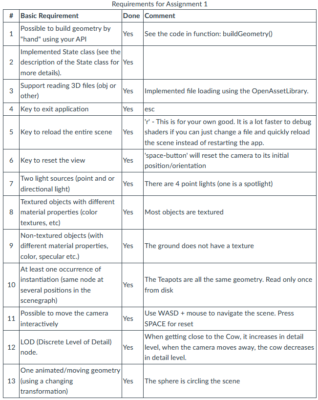
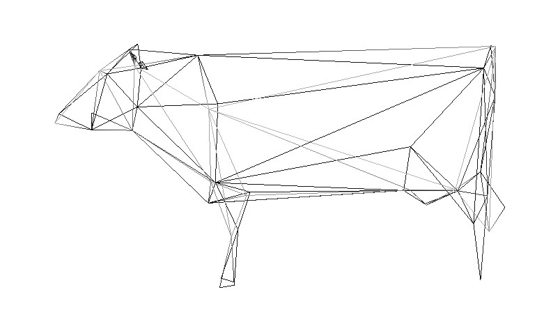
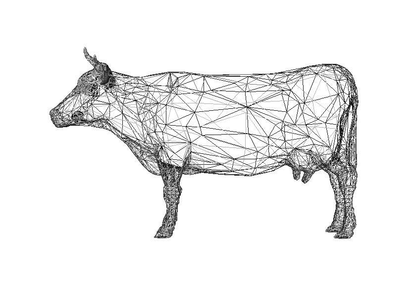

# Assignment 1: Shader based SceneGraph

Due: Tue Feb 13, 2024 5:00pm
Available after Jan 16, 2024 10:00am

## Introduction

The goal is to learn how to implement a node based scene graph for real time rendering. You will implement the core of a scenegraph used in the upcoming exercises. Your scenegraph will be the core for the upcoming assignments. Your initial design will matter!

Another goal of this excercise is to learn how to take existing code, redesigning it into something...better!

You have two options:

1. Design everything and implement the assignment from scratch.
2. Use the existing viewer/code in the vrlib example.

### VRLib viewer

The existing viewer (vrlib/examples/viewer) can briefly be described with:

- Completely Shader based (#version 4.3.0)
- Uses Assimp for loading various 3D file formats.
- Adds a (very simple) scene format in XML for easier prototyping of 3D scenes.
- WASD camera movement.
- Utilizes glm library for all 3D math.

### Shader based

Your scene graph should be completely shader based, meaning that:

Each and every geometry being rendered should be done with a Vertex shader and a Fragment shader. Forget about fixed functionality pipeline (OpenGL1.0). This also means that you should use your own uniforms for communicating with the shaders.

You are NOT allowed to use #version 120 (That is OpenGL 2.1). Forget about using the existing uniforms such as gl_ModelViewProjectionMatrix. If you use some bleeding edge version it might be problematic to run it in the CS department lab (or on my computer). So try to keep it at max OpenGL 4.3.0. Typically you write something like this at the top of your shader file:

> #version 410 core

## Description

You shall create a scenegraph with nodes, groups, transformations and geometries. You will use this scenegraph to render a scene using a visitor and state objects associated with nodes.
The scenegraph shall be implemented in C++ and you should take care to write object oriented code. No C programming please.

The following classes shall be implemented:

- **Camera**

  This node defines a projection and a view matrix. This can be seen as a way to position the camera during rendering.

- **Scene** (Optional)
  
  A class keeping track of everything else (visitors, camera, lights...).
  
  *Hint: Make it a Singelton.*

  - **Node**

    An abstract base class for all nodes in your scenegraph. You should put some functionality to accept visitors here but not much else. You will not use this directly in your scenegraph, only derive from it. Which means that a Node is an abstract base class. You should be able to set a State (see below) on each node.
  
  - **Group**

    Derived from class Node. A **Node** that can contain any number of other nodes (0..n).

  - **Transform**

    Derived from Group. A Node that transforms all nodes below it in the scenegraph. Note that you should not change (recalculate vertices positions) the nodes below the transform when doing this, that would give you trouble when using instantiation. See notes on RenderVisitor below for possible solutions.

    *Hint: Inherit from the Group class to make it possible to add children directly to a transform.*

  - **Geometry**

    Derived from Node. A node containing actual geometry data. That is:

    - Vertices
    - Vertex colors (if present, not necessary)
    - Normals
    - Texture coordinates (possibly for multiple layers)

    Coordinates in a Geometry, is always stored in a local coordinate system. Ancestor (parent) Transform nodes will transform this geometry. (This should not require any effort on your part, just keep it in mind). Remember that it should be possible to have (pointers to) the same geometry below several different transforms (instancing). It is only required that you handle one primitive type. The Geometry should have a **draw()** method which executes the gl command required for drawing the geometry.

    **It must be possible to build a geometry "by hand" from your API. That is, to create an empty geometry and build a model by supplying vertices, indicies, normals and vertex attributes to the geometry.** (as arrays).

  - **State**

    A class containing all state information. Shall include an apply method to apply all contained state. Required state data is:

    - Lighting (enable/disable, global and for each light)
    - CullFace (enable/disable culling of backfacing faces) (See GL_CULL_FACE)
    - Material - one material can be applied to the current state
    - Texture - one or more textures can be applied to the current state.
    - A State should also consist of Shader (Vertex/Fragment/Geometry) and Program. A Program also has a number of Uniforms and Attributes

  - **Material**

    A class describing a material to be applied to surfaces. All colors (ambient, diffuse and specular) and shininess must be included. You shall also implement an apply method to apply the material to the current state.

  - **Texture**

    A class containing a texture to be applied to surfaces. Implement a method for applying the texture, possibly with the layer to apply it to as an argument. (See glGenTextures, glBindTexture, glTexImage2D and GL_TEXTURE_2D).
  
  - **Light**

    A class describing a light. All colors (ambient, diffuse and specular) and position must be included. Attenuation factors are optional but might help you set up a nice looking scene. Implement a method to apply the light, possibly with the opengl light number to assign it to as a parameter. Note that the last (fourth) parameter when setting the position of a light in OpenGL decides if it is a directional or positional light.

  - **NodeVisitor**

  An abstract base class for nodevisitors used to traverse the scenegraph.
  
  *Hints:*
  1) *Check out the **Visitor Design Pattern** links below.*
  2) *Implement traversing of Groups here since you will probably need it in all decendant visitors.*

- **RenderVisitor**

  This is the (node) visitor that will handle the actual rendering. It must traverse the scenegraph and apply transformations and states as they are encountered and draw geometries when reached. As noted above the scene graph should not be modified by this visitor. Geometries that are transformed should not be modified. Whenever a transformation matrix is visited, you need to push and concatenate matrix onto a matrix stack. Each drawable object will get its own MODEL transform. Then when you leave a Transformation node you pop the matrix stack.

- **UpdateVisitor**

  This class will execute any UpdateCallback that a node might have. It injects functionality into your scene graph. An UpdateCallback (see below) will then be executed.
  The UpdateVisitor class is derived from the basic NodeVisitor class that can change the scene graph (Update transforms, set Uniform values etc). For each visited node, is there an UpdateCallback? If so, call a virtual method.

- **UpdateCallback**

  Base class for a callback function that will update/process/modify a node. Executed by the UpdateVisitor.

It must be possible to insert a node (ie, pointers to the same object) at several points in the scenegraph and thus create instances. It could look like this:

``` c
groupnode1
 --- transform1
    --- geometry1
 --- transform2
    --- geometry1
```

Thus you would see geometry1 rendered twice with different transformations.

## Reader

A class for reading a 3D geometry file. You are free to use the [OpenAssetLibrary](http://www.assimp.org/) library which is being utilized in the sample viewer. The Reader class should read a file and return a Node (or just Geometry) with the renderable information available in the loaded files.

Notice that some file formats support hiearchies of nodes, including transformations, so your Reader must support that.

**I strongly recommend that you extend the .xml file format from the viewer to allow you to build scenes scenes from an xml file, instead of from c++ code as it will make you crazy waiting for compilation for moving a box 1m to the left....**

Also,

1. Your functionality/code for actually doing things when traversing the scenegraph should be (mostly) in the visitor. General functionality can be put in the NodeVisitor base class. Basically, the **accept** method of a node class should only contain *visitor->apply( this )*.
2. Use double dispatch (check the **Visitor Design Pattern** links below) to make the visitor do the right thing for the right type of class. **Don't use switch/case or dynamic_cast.**
3. Variables required for a class (eg colors for lights or materials) should be possible to set individually. That is, you should have a setAmbient method for the ambient color and so on.
4. Avoid public attributes in the classes. Use set/get methods.
5. Make sure you have a key to exit your application.
6. Only the classes specified as nodes should be nodes. In other words: State, Texture, Material and so on should not be nodes.

## Application

Now use these classes to write a program where you load several models and arrange into a scene. Your report **MUST** list the basic requirements in a table as seen below:



You can use [these models](https://www8.cs.umu.se/kurser/5DV180/VT22/lab/cow.zip) for the LOD demonstration. The zip file consists of a set of .obj files of a cow in different resolutions. From 94 to 9496 triangles:




In addition your report **MUST** have a table listing the bonus features, *even if you do not intend to implement any of the bonus features.* Otherwise there might be no bonus points on your assignments!!

**You may get bonus points** by implementing some of the following features. You can recieve **0.5** points per item with a maximum of **1** bonus point.

## Report

The exercise have to be turned in as a **well-written report** that describes how you have solved the assignment. Include a screen capture that shows the system "in-action". **Do not forget the tables with the implemented basic and bonus requirements.**

## VERY IMPORTANT INFORMATION

Because you are going to collect 3D models, textures etc. it might not be super practical to zip everything and upload to Canvas.
Especially if it contains compiled code from your own computer.

Therefore (and this is important):

- Make sure your code builds and executes on either the departments Linux computers or Windows (VS2019-VS2022).
- Zip your code/data and upload to Canvas together with your well written report.
- If you are using Windows, then you can include all the runtime libraries and executables (basically the bin directory from your project).
- In addition, leave code/data and compiled/executable in your home directory ~yourUser/edu/5DV180/lab1
- Make sure I have read access rights to all the files in the subdirectory: **chmod -R 755 ~edu/5DV180**

## Resources

### VRlib

[VRlib](https://www.canvas.umu.se/courses/13379/pages/vrlib) - an utility library for matrices, and I/O.

You are free to use this library, or write your own (if you want more work).

## Tips

- Use the CHECK_GL_ERROR_LINE_FILE() macro extensively to catch any errors that you have in your OpenGL code.
- You will soon experience the problem of "ownership of data", which soon leads to memory leaks and or memory corruption. Use smart pointers (std::shared_ptr) or some other implementation of this functionality to avoid these problems.
- Use the excellent debugging tool RenderDoc to debug any state, textures, buffers etc. You can download it from the [official site](https://renderdoc.org/)

## Links

- [Models and textures](https://www.canvas.umu.se/courses/13379/pages/links)
- [Sceen graphs, a description of the concept](http://what-when-how.com/advanced-methods-in-computer-graphics/scene-graphs-advanced-methods-in-computer-graphics-part-1/)
- [Visitor Design Pattern in C++](https://sourcemaking.com/design_patterns/visitor/cpp/2)
