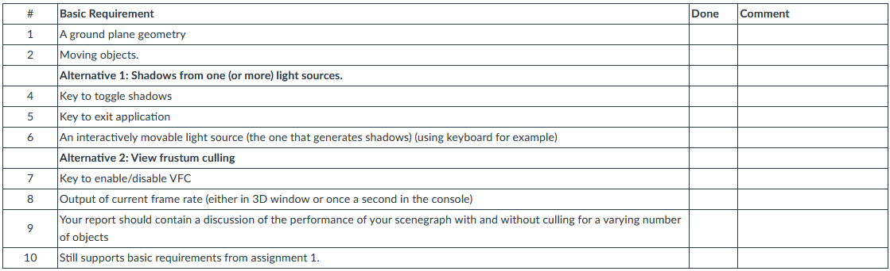
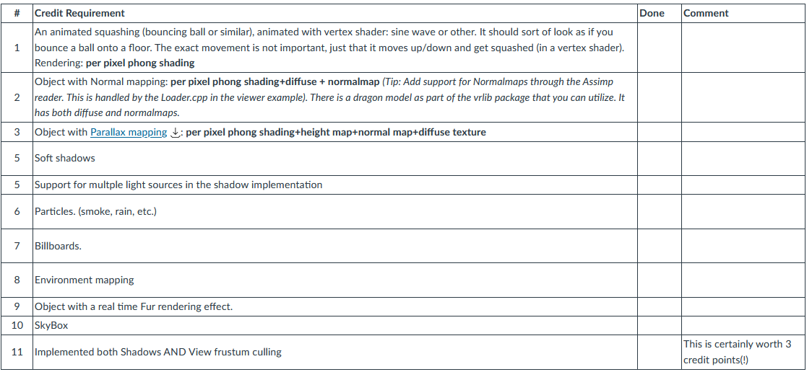

# Assignment 2: Shadows / View Frustum Culling

## Description

In this assignment you have two alternatives: Implement Shadows using shadow mapping OR implement support for View Frustum Culling.

**If you implement both, you will get full credit!**

The focus of this exercise is to add more support for Shader based rendering, including **Shadows** (using shadow mapping) or view frustum culling.

## Alternative 1: Shadows

This will require you to implement support for rendering a scene from the point of a light source to a depth texture. 

You will have to render the scene twice: First from the point of the lightsource to a depth texture, then a second time with colors/shaders etc. where the depth (shadow texture) will be used to determine which fragments that are in shadow and which are not.

### Tutorial

An excellent tutorial for Shadow Mapping can be found here. Use that as an inspiration.

[Shadow Mapping](http://www.opengl-tutorial.org/intermediate-tutorials/tutorial-16-shadow-mapping/)

[Render to Texture](http://www.opengl-tutorial.org/intermediate-tutorials/tutorial-14-render-to-texture/)

### Specifications

You will need to create or modify the following classes:

- **State**

    You will need support for multiple textures. (Normal maps, specular maps etc.)

- **Camera**

    This node defines a projection and a view matrix.
    
    You will need to implement support for multiple cameras, you need to be able to render from a light point of view to a depth texture.

- **RenderToTexture**

    Class that can be attached to the scene. It will recieve a rendered image from a specified camera. This "picture" can then be used as a texture when rendering another part of the scene.

## Altarnative 2: View frustum Culling

A major improvement (of course) is to add Culling to your scenegraph.

Below is additional information needed to implement culling in your scenegraph.

- **BoundingSphere/Box**

    Each node must have a bounding volume that covers all nodes below it in the scenegraph. You can choose for yourself whether to use a sphere or a box for this. Remember that the bounding volume must be updated when transformations in the scenegraph changes. Make sure that you use a dirty flag to only update the bounding volumes when needed.

    *Hint: Having **expandBy** methods to expand a bounding volume by a point or another bounding volume gives a nice and clean interface.*
- **Node**

    You have to implement a virtual method (eg computeBound) for each node type to calculate the bound for that type of node, eg traversing children to calculate the bounding volume of a group. You need to make it possible to dirty the bound so that you don't recalulate it unless it is necessary. When the bound of a node changes you need to update (dirty) the bounds of all nodes that contain this node, ie it's parents, so you also need to keep a list of parents in each node.

    *Hint: Add an **addParent** method to the node and call this from the method that adds a child node to a group. Eg Group::addChild( node ) { "add node to list"; node->addParent( this ); }.*

- **CullVisitor**

    The CullVisitor will in many ways replace the RenderVisitor from assignment 1 (and also described above). When it traverses the scenegraph it shall accumulate all the information needed to do rendering (most notably, transformations and state) but not actually apply it. For each geometry in the scenegraph (that is not culled) you should instead create a render node (new class, see below) containing the geometry and the accumulated information. These render nodes are put into a render list (possibly sorted on eg depth or state).

    The actual culling is a matter of comparing your bounding volumes to the volume representing the view frustum and make sure that no nodes that are outside of the view frustum are added to the render list. Since the bounds you calculate/store for each node cannot include transformations below the node you also have to transform the bounds using the collected transform here.

    It must be possible to turn culling on and off interactively and you must be able to set the viewmatrix independently from the current OpenGL view matrix.

    You can find a basic example of how to test if a bounding box is within the view frustum [here](https://www.canvas.umu.se/courses/13379/files/2845188?wrap=1). It is based on [this](https://www.canvas.umu.se/courses/13379/files/2845190?wrap=1) paper. Please note that this is only a basic example, you are encouraged to implement this from scratch yourself. You can find a link to a full tutorial in the links section below.

### Links

[A View Frustum Culling Tutorial](http://www.lighthouse3d.com/tutorials/view-frustum-culling/)
[Efficient View Frustum Culling](http://www.cescg.org/CESCG-2002/DSykoraJJelinek/index.html)

## Shaders/Rendering effects that you need to implement

All objects in the scene must be rendered with shaders. NOT with the fixed pipeline.

All objects should cast and recieve shadows.

## Basic requirements

Your application must support the features in the table below (only shadow OR View frustum culling unless you implement both).

Also, your report **MUST** list the basic requirements in a table as seen below:

In addition your report **MUST** have a table listing the credit features. Otherwise there might be no credit points on your assignments!!

You may get bonus/credit points by implementing some of the following features.

[Parallax mapping link](https://www.canvas.umu.se/courses/13379/files/2845189?wrap=1)

### Credit points

You may get credit points by implementing some of the features in the Credit Requirement table above. You can recieve **0.5** points per item with a maximum of **2** credit points. However, if you implement both Shadows and Culling you will get a whopping **3 credit points**, even if none of the other credit features are there...

*Please CLAIM your credit point in your report using the above table. Increases your chances of me finding it ;-)*

## VERY IMPORTANT INFORMATION

Because you are going to collect 3D models, textures etc. it might not be super practical to zip everything and upload to Canvas. Especially if it contains compiled code from your own computer.  Therefore (and this is important).

- Make sure your code builds and executes on either the departments Linux computers or Windows (VS2019-VS2022).
- Zip your code/data and upload to Canvas **together with your well written report**.
- If you are using Windows, then you can include all the runtime libraries and executables (basically the bin directory from your project).
- In addition, leave code/data and compiled/executable in your home directory ~yourUser/edu/5DV180/lab2
- Make sure I have read access rights to all the files in the subdirectory: **chmod -R 755 ~edu/5DV180**

## Tips

Use the excellent debugging tool **RenderDoc** to debug any state, textures, buffers etc. You can download it from the [official site](https://renderdoc.org/).

## Resources

[VRlib](https://www.canvas.umu.se/courses/13379/pages/vrlib) - an utility library for matrices, and I/O.

You are free to use this library, or write your own (if you want more work).

[Textures and models for download](https://www.canvas.umu.se/courses/13379/pages/links).
