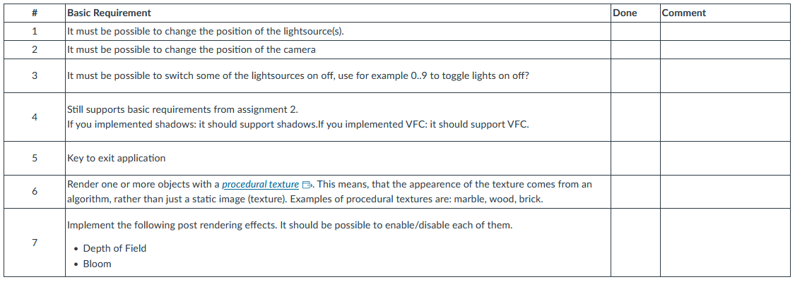
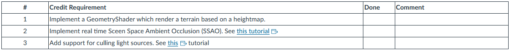

# Assignment 3: Project

## Description

In this excercise you have two (2) options:

### 1. Implement a cool and commonly used rendering techique called Deferred shading

This is an individual assignment where you can if you turn it in in time and add bonus features can get 1+1 credit points. Read more further down in this document.

This will add more cool features to your already awsome rendering engine. Read more below.

*or*

### 2. Design and implement a rendering project of your own choosing

**If you turn in this assignment in time you will get 1 credit point and depending on the complexity up to another 1 credit point. (2 in total).
I will be the judge!**

If you choose this option, read more about [here](https://www.canvas.umu.se/courses/13379/pages/assignment-3-projects).

If you choose door number one, Deferred Shading, read on...

## Deferred rendering

Individual assignment.

- Add support for rendering the whole scene into textures (depth, color, normals etc), aka. G-Buffer
- Add support for setting the camera/projection before rendering the scene to a texture.
- Populate a scene with various objects rendered with effects from assignment 1 (and other effects of your liking).
- An environment, such as a terrain, plane or skybox. (or all of the above).
- Render the whole scene in Deferred Shading with many >= 4 lights.
- Should be possible to render all of your textures in the G-Buffer to small screen aligned quads (at the bottom of your display). So one with normals, one with diffuse color, one with positions, depth buffer etc. Also really good for debugging.
- Some of the lights should be moving, could have different colours etc.
- Add a POST processing effect: bloom, blur, dilation or something else of your liking. Remember, a post processing effect is:
    Render the scene to a texture, apply an effect (vertex/fragment shader), render that to another texture, which is applied to a screen aligned quad, which is showed to the user. Several post processing effects can be chained together by doing this to achieve the final effect. Make it possible to switch the effects on/off.

Create your own models in Blender or any other tool, or use the ones [available](https://www.canvas.umu.se/courses/13379/pages/links).

### Render the whole scene in Deferred Shading with many (more than 4 lights)

Your last task for this assignment is to render the above described scene with the so called Deferred Shading technique.

Deferred shading is a technique where the complete scene is rendered once to something often referred to as the G-buffer. The action game [S.T.A.L.K.E.R](http://www.stalker-game.com/)

Links to an external site. is one example of commercial use of this tecnique, KillZone 2 is an example (described in the course book).

The G-buffer is a number of textures that contains: position for each visible part of the scene, the normal of each point, the diffuse color for each point. With this information + the information for each lightsource the scene can be illuminated, in screenspace.

Observe that you have to use a FloatingPoint texture as a target (storing a position in RGB8 is just not enough).
If you dont use FloatingPoint textures (if you dont have support for them), then remember that colors goes from 0..1 so you would have to convert your normal vectors with a range from [-1..1] into [0..1] when rendering to the texture. When you are later using this texture, you have to convert it back.

You create floating point texture using *GL_RGBA16F_ARB* or *GL_RGBA_FLOAT16_ATI*:

> glTexParameteri(GL_TEXTURE_2D, GL_TEXTURE_MIN_FILTER, GL_NEAREST);
> glTexParameteri(GL_TEXTURE_2D, GL_TEXTURE_MAG_FILTER, GL_NEAREST);
> glTexParameteri(GL_TEXTURE_2D, GL_TEXTURE_WRAP_S, GL_CLAMP);
> glTexParameteri(GL_TEXTURE_2D, GL_TEXTURE_WRAP_T, GL_CLAMP);
> //create the texture
> glTexImage2D(GL_TEXTURE_2D, 0, GL_RGBA16F_ARB , _iWidth, _iHeight,
> 0, GL_RGB, GL_FLOAT, 0);

Read more and get inspiration from the following resources, the last one from Delphi 3D has a working sample application (only in pascal, using vertex shaders and under windows, so no free code there!)

- http://learnopengl.com/#!Advanced-Lighting/Deferred-Shading
- [Nvidia about deferred shading](http://download.nvidia.com/developer/presentations/2004/6800_Leagues/6800_Leagues_Deferred_Shading.pdf)
- [OpenGL on Multiple Render Targets](http://www.gamedev.net/reference/articles/article2333.asp)

### Interactive control

When running your executable, it should be intuitively (easy) to change the position/orientation of the camera to watch the objects from different positions.

## Basic Requirements

Your application must support the features in the table below

Also, your report **MUST** list the basic requirements in a table as seen below:

### Credit

You may get bonus points by implementing some of the following functions. You can recieve **0.5** points per item with a maximum of **1** bonus point.

**Please CLAIM your bonus point in your report by using the table below!! Increases your chances of me finding it ;-)**

### Report

The exercise have to be turned in as a well-written report that describes how you have solved the assignment. Include a screen capture that shows the system "in-action".

**When printing the source-code, please print the files in alphabetical order, otherwise we get such a hard time to find the files we are looking for.**

We accept solutions built under the following platforms:

- Linux lab (source,data,executable should be in ~user/edu/5DV180/)
- V2017, VS2019, VS2022: ~user/edu/5DV180/lab3.zip source,data,executable + any other run-time library thats required..

## VERY IMPORTANT INFORMATION

Because you are going to collect 3D models, textures etc. it might not be super practical to zip everything and upload to Canvas.
Especially if it contains compiled code from your own computer. 
Therefore (and this is important).

- Make sure your code builds and executes on either the departments Linux computers or Windows (VS2019-VS2022).
- Zip your code/data and upload to Canvas together with your well written report.
- If you are using Windows, then you can include all the runtime libraries and executables (basically the bin directory from your project).
- In addition, leave code/data and compiled/executable in your home directory ~yourUser/edu/5DV180/lab3
- Make sure I have read access rights to all the files in the subdirectory: **chmod -R 755 ~edu/5DV180**

## Resources

[Links](https://www.canvas.umu.se/courses/13379/pages/links)

### Code

- [VRlib](https://www.canvas.umu.se/courses/13379/pages/vrlib) - an utility library for matrices, and I/O. You are free to use this library, or write your own (if you want more work).
- VRlib contains an example of using the FrameBufferObject to render a scene to a texture. (examples/framebuffer_example). It is at the same time an example of how to implement screen-based filter effects.

- In VRlib there is also examples/render_to_depth which another example where both depth and color buffer is defined as render targets.
